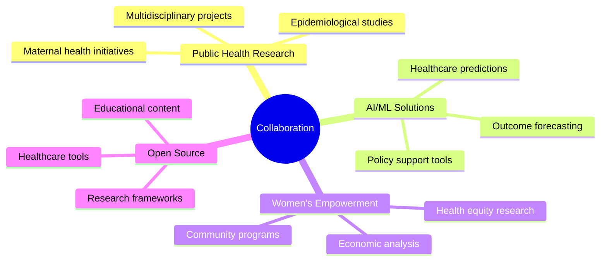

  
  
  

---

  I am an accomplished <strong>Research Scientist</strong> specializing in epidemiological research at the intersection of <strong>women's and child health</strong> with <strong>women's economic empowerment</strong>. My work focuses on harnessing innovative machine learning and AI tools to analyze and forecast reproductive health outcomes, with the ultimate aim of reducing maternal mortality rates and influencing data-driven policy decisions.

  
🌍 **Based in Nairobi, Kenya** | 📧 **keyegon@gmail.com** | 📱 **+254 739 579 369**

---

## 🚀 Featured Projects

  
### 🔬 [Maternal Health Prediction Model](URL_TO_YOUR_REPO_1)

A machine learning model that predicts maternal health outcomes using epidemiological data to reduce mortality rates and improve healthcare delivery in underserved communities.

**Technologies:** `Python` `TensorFlow` `Epidemiological Data` `Docker` `Flask`

---

### 📊 [Women's Economic Empowerment Analytics](URL_TO_YOUR_REPO_2)

Statistical analysis and visualization platform examining the correlation between women's economic empowerment and health outcomes across sub-Saharan Africa.

**Technologies:** `R` `ggplot2` `Statistical Modeling` `Shiny` `Public Health Datasets`

---

### 🏥 [Healthcare Policy Dashboard](URL_TO_YOUR_REPO_3)

Interactive dashboard for policymakers to visualize health metrics and make data-driven decisions for reproductive health programs.

**Technologies:** `SQL` `Power BI` `Data Visualization` `Azure` `Reporting`

---

## 🎯 My Focus & Interests

<table>
<tr>
<td width="50%">

### 🔬 **Research & Analysis**
- Epidemiology & Public Health research
- Women's Health & Economic Empowerment
- Population health dynamics
- Evidence-based policy development

</td>
<td width="50%">

### 🤖 **AI & Technology**
- Machine Learning & AI in Healthcare
- Health outcome prediction models
- Data-driven policy advocacy
- Global public health tech solutions

</td>
</tr>
</table>

---

## 🌱 Currently Learning & Growing

- 🚀 **Advanced AI Techniques** for health outcome prediction
- 💡 **Cutting-Edge Reproductive Health Research** and latest discoveries  
- 📈 **Innovative Women's Economic Empowerment Approaches** and community uplift strategies
- 🔬 **Next-generation epidemiological methodologies** for complex health challenges

---

## 👋 Let's Collaborate!

I'm enthusiastic about joining forces on projects related to:

- 👨‍👩‍👧‍👦 **Multidisciplinary Public Health Research** - Bridging disciplines for comprehensive solutions
- 💻 **AI-Driven Solutions for Maternal Health** - Developing technologies to save lives
- 📊 **Data Analysis for Gender Equality & Health** - Unlocking insights to foster equity
- 📜 **Policy-Oriented Research in Women's Empowerment** - Shaping impactful change through evidence

---

## 🛠️ Skills & Expertise

  
### Professional Skills
**Artificial Intelligence & Machine Learning** | **Epidemiological Research** | **Project Management** | **Data Analysis & Statistics** | **Scientific Writing & Publication** | **Policy Advocacy** | **Team Leadership & Mentoring**

### Technical Arsenal

**Programming Languages & Frameworks**

**AI/ML Libraries & Tools**

**Databases & Analytics**

**Detailed Technical Proficiencies:**
- **Python:** pandas, Polars, NumPy, scikit-learn, TensorFlow, PyTorch, XGBoost
- **R:** ggplot2, dplyr, caret, shiny  
- **SQL:** MySQL, PostgreSQL | **NoSQL:** MongoDB
- **BI & Productivity:** Power BI, Microsoft Office Suite

---

## 🏆 Certifications & Achievements

| 🎯 **AI & Machine Learning** | 🗓️ **Year** | 🏢 **Provider** |
|------------------------------|-------------|------------------|
| MongoDB Python Developer Path | 2024 | MongoDB |
| Open Source Models with Hugging Face | 2024 | DeepLearning.AI |
| Building LLM Applications using Prompt Engineering | 2024 | Analytics Vidhya |

| 📊 **Data Science & Analytics** | 🗓️ **Year** | 🏢 **Provider** |
|---------------------------------|-------------|------------------|
| Excel: Mother of Business Intelligence | 2024 | Codebasics |
| Professional Data Scientist | 2024 | DataCamp |
| Certified Data Scientist | 2024 | 365 Data Science |
| Google Data Analytics | 2024 | Google |
| John Hopkins Data Science Program | 2024 | Johns Hopkins |

| 🎖️ **Special Programs** | 🗓️ **Year** |
|-------------------------|-------------|
| KaggleX BiPOC Mentorship Program | 2024 |

---

## 🎓 Education Background

| **Degree** | **Institution** | **Specialization** |
|------------|-----------------|-------------------|
| **Ph.D. in Epidemiology** | Jomo Kenyatta University of Agriculture & Technology | Research Methodology & Health Systems |
| **M.Sc. in Health Systems Management** | Kenya Methodist University | Healthcare Administration |
| **B.Sc. in Statistics** | University of Nairobi | Statistical Analysis & Data Science |

---

## 📊 GitHub Analytics

  

---

## 🎬 Featured Content & Platforms

### 📺 DataStride YouTube Channel
*Creating educational content on data science, AI, and public health research*

### 🌐 Professional Portfolio
*Showcasing real-world projects in epidemiology and machine learning*

---

## 📬 Get in Touch & Connect

  
📧 **Email:** [keyegon@gmail.com](mailto:keyegon@gmail.com)  
📞 **Phone:** +254 739 579 369  
🔗 **LinkedIn:** [Erick Yegon, PhD](https://www.linkedin.com/in/erick-yegon-phd-4116961b4/)  
🎥 **YouTube:** [DataStride](https://www.youtube.com/@DataStride)  
🌐 **Portfolio:** [Erick Kiprotich Yegon's Portfolio](https://codebasics.io/portfolio/Erick-Kiprotich-Yegon)  
📍 **Address:** P.O. Box 61115-00200, Lavington, Nairobi, Kenya

---

## 🌟 Fun Fact!

I'm deeply passionate about leveraging **machine learning tools** to drive meaningful change in public health—especially for women's health and economic empowerment.

---

  <em>Thank you for visiting my profile! I look forward to connecting, collaborating, and contributing to impactful projects.</em>
    
  
  <!-- Social Badges -->
  
  
  
  
  
    
  
  
  
   
  
  **💡 "Data-driven insights today, healthier communities tomorrow"**

